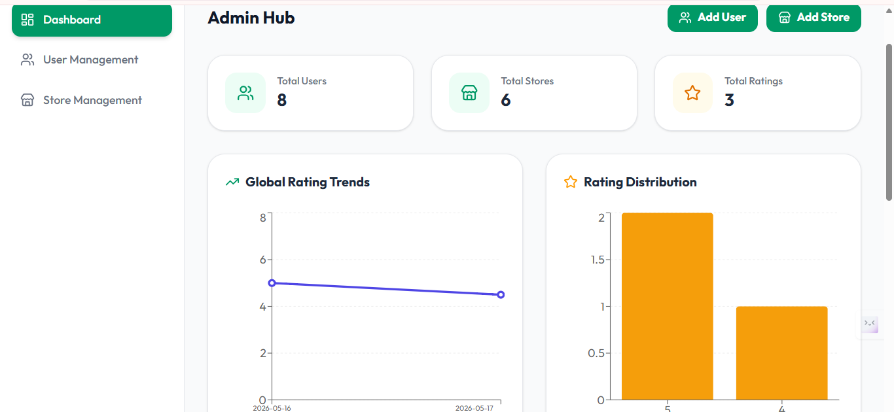
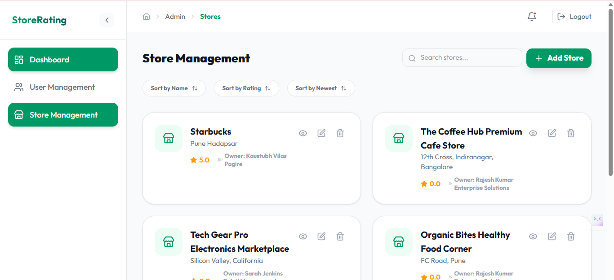
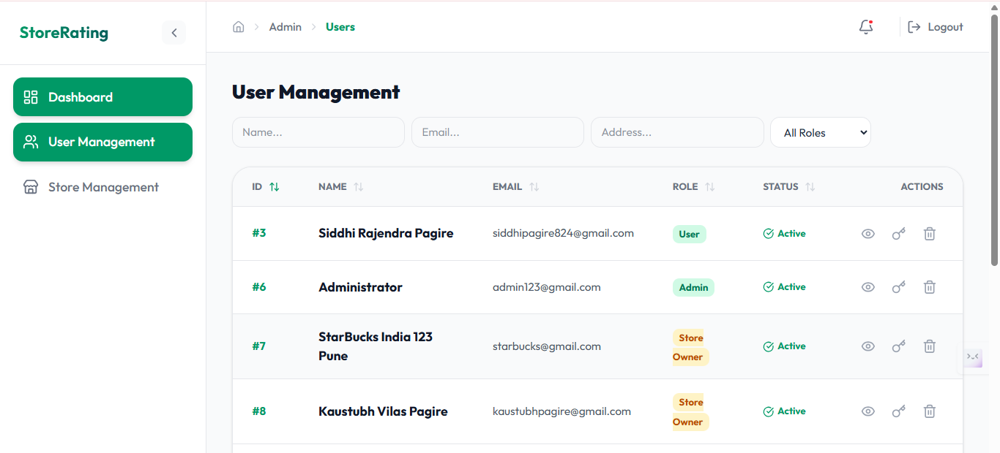
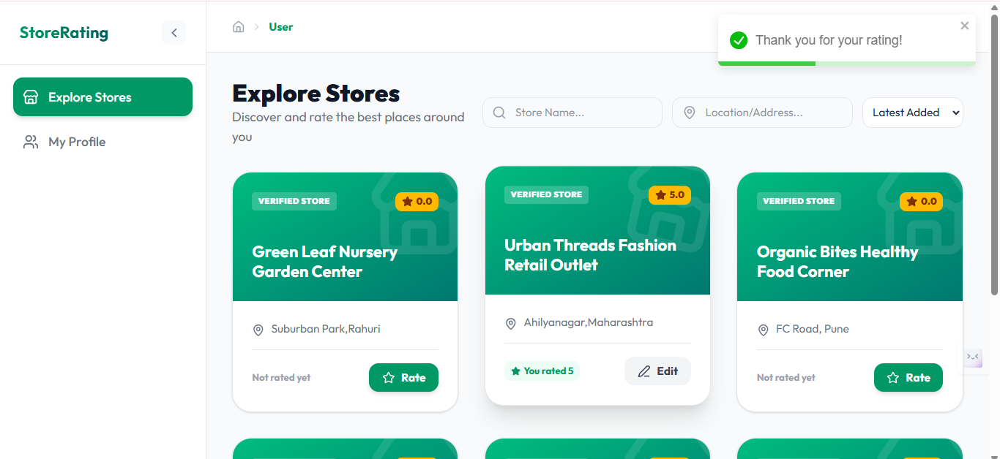

# Store Rating Platform 🏪⭐

A premium, full-stack store rating and analytics platform built with **React 19**, **Node.js**, and **MySQL**. This platform features a role-based access control system (RBAC) designed for Administrators, Store Owners, and Normal Users.

### 📸 Platform Preview

| Admin Dashboard | Store Management |
| :---: | :---: |
|  |  |

| User Management | User Dashboard |
| :---: | :---: |
|  |  |

## 🚀 Key Features

### 🛠️ System Administrator
*   **User Management**: Full CRUD for Admin, Owner, and Normal users.
*   **Store Management**: Create and assign stores to owners using a simplified dropdown system.
*   **Analytics Dashboard**: Global trends, user counts, and rating distributions via Recharts.
*   **Security**: Reset user passwords and toggle account status (Active/Inactive).
*   **Audit Log**: View detailed logs of all ratings submitted to any store.

### 🏪 Store Owner
*   **Performance Analytics**: Dedicated dashboard with rating trends (30 days) and star distribution.
*   **Customer Feedback**: Real-time log of user ratings including names, emails, and specific feedback.
*   **Profile Management**: Update business details and secure password management.

### 👤 Normal User
*   **Store Discovery**: Search stores by **Name** or **Address** with advanced sorting.
*   **Rating System**: Submit 1-5 star ratings with anti-duplicate logic (updates existing ratings).
*   **Personal Dashboard**: View previously submitted ratings and track feedback history.
*   **Profile Update**: Manage personal information and credentials.

## 💻 Tech Stack

*   **Frontend**: React 19, Tailwind CSS (V4), Recharts, Lucide React, React Toastify, Framer Motion.
*   **Backend**: Node.js, Express, MySQL (mysql2/promise), JWT Authentication.
*   **Security**: Helmet, Express Rate Limit, HPP, Bcrypt password hashing.
*   **UI Theme**: Ocean Teal (Emerald & Teal palette).

## 🛠️ Getting Started

### Prerequisites
*   Node.js (v18+)
*   MySQL Server
*   npm or yarn

### 1. Database Setup
Create a database named `store_rating_db` and execute the schema found in `server/migration.sql`.

### 2. Environment Configuration
Create a `.env` file in the `server` directory:
```env
PORT=5000
DB_HOST=localhost
DB_USER=your_username
DB_PASSWORD=your_password
DB_NAME=store_rating_db
JWT_SECRET=your_super_secret_key
```

### 3. Installation
```bash
# Install server dependencies
cd server
npm install

# Install client dependencies
cd ../client
npm install
```

### 4. Running the Application
```bash
# Start backend (from /server)
npm start

# Start frontend (from /client)
npm run dev
```

## 📁 Project Structure
*   `/client`: React frontend with Tailwind V4 and Recharts.
*   `/server`: Express backend with MySQL pool connection and role-based middleware.
*   `/server/models`: Data layer with optimized SQL queries.
*   `/server/controllers`: Business logic for Admin, Owner, and User roles.

## 🎨 UI Aesthetics
The platform uses the **Ocean Teal Theme**, focusing on high-contrast accessibility, smooth Framer Motion transitions, and a premium "glassmorphism" aesthetic for cards and navigation.

---
Developed as part of the Full Stack Coding Challenge.
